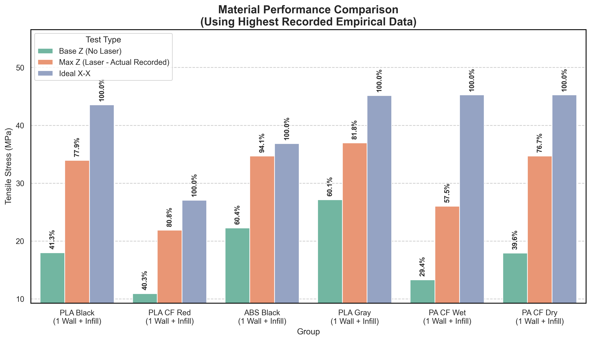

# Laser FDM + Printer Suite

> ⚠️ **CRITICAL SAFETY & EXPERIMENTAL DISCLAIMER**:  
> This entire software project, hardware integration, and laser-assisted 3D printing pipeline are **100% EXPERIMENTAL** and provided strictly on an **AS-IS, AT-YOUR-OWN-RISK** basis.  
> **All wall smoothing modes can contain software bugs.** Specifically, **Deep Mode** and **all Wobble modes (Deep Wobble & Voxel Wobble)** still contain known bugs with complicated geometries, fine features, sharp overhangs, and non-manifold meshes.  
> High-power laser diodes introduce serious fire, permanent optical radiation (blindness), and toxic fume hazards. Never leave equipment running unattended, maintain proper ventilation, and always wear certified optical safety goggles.  
> **MANDATORY: Always inspect generated G-code in the 3D Simulator or G-Code Visualizer before printing on physical hardware!**

---

## What This Printer Can Do

This hybrid machine combines standard FDM 3D printing with strategically mounted laser diodes. By remelting and modifying the plastic dynamically during the print, it achieves features impossible on a standard printer:

* **Glossy, Glass-like Top Surfaces:** The laser does a final glazing pass to melt away top layer extrusion lines.
* **Invisible Z-Seams & Smooth Walls:** Side-mounted lasers remelt the outer perimeters, fusing layer lines together horizontally and vertically for injection-molded quality.
* **Extreme Z-Axis Strength:** By pre-heating the previous layer milliseconds before new plastic is laid down (and through structural infill strategies), layer adhesion is dramatically increased.
* **Virtual PCBs:** Capable of pyrolyzing carbon-loaded filament to create internal conductive traces.

Here is a glimpse of the data showing the structural strength improvements (comparing standard printing vs. laser-assisted modes):



---

## Video Showcases

See the Laser FDM process in action! 

* **Testing Z Axis Strengths:** [Watch on YouTube](https://www.youtube.com/watch?v=vpd5nh9Lj98&t)
* **Laser Smoothness vs Non Laser:** [Watch on YouTube](https://www.youtube.com/watch?v=Z4Z035srbKI&t)
* **First look at laser FDM printing:** [Watch on YouTube](https://www.youtube.com/watch?v=qHYnePu4Ysw)
* **Full Open-Source Build Guide:** *Coming soon!* (This upcoming video will walk you through exactly how to build this printer yourself.)

---


## The Hardware Build

*Instructions and CAD files for building your own hybrid laser printer will be fully detailed in our upcoming open-source build guide video.*

The build primarily involves upgrading a standard FDM printer with:
* **Side-Mounted Lasers:** Two angled lasers focused precisely on the nozzle tip for wall smoothing.
* **Vertical Laser:** One downward-facing laser for top surface glazing and preheating.
* **Upgraded Cooling & Exhaust:** To safely remove fumes generated by the laser remelting process.
* **Optical Safety Enclosure:** Certified safety shielding is absolutely required to block scattered laser radiation.

---

##  Software Quick Start

1. **Launch the Master Web Portal**:
   - Double-click **`index.html`** right in this folder to open the Laser 3D Printer Suite.
   - It runs completely offline with zero setup or servers required.
   - Use the **Slicer Configurator** to visually configure laser features and generate the exact OrcaSlicer post-processing command.
   - Use the **G-Code Visualizer** or **3D Toolhead Simulator** to inspect toolpaths layer-by-layer before sending them to your machine.

2. **Configure OrcaSlicer**:
   - In OrcaSlicer: **Print Settings** > **Others** > **Post-processing scripts**.
   - Paste the command line generated by the Configurator:
     ```text
     "your_path\python.exe" "your_path\orcaslicer_laser_advanced.py"
     ```
   - When slicing, OrcaSlicer automatically calls the script to inject synchronized laser commands.

3. **Printer Firmware (`printer.cfg`)**:
   - Contains reference Klipper output pins (`laser_pwm1`, `laser_pwm2`, `laser_pwm3`) and safety interlocks.

---

## 📂 Release Folder Contents

* **`index.html`**: The main launcher & portal (highest level). Open this in any browser!
* **`web_tools/`**: All web applications:
  * **`configurator/index.html`**: Parameter generator with JSON preset export/import, Virtual PCB support, experimental slicing paths, and live Alpha warnings.
  * **`gcode_visualizer/`**: Fast 2D/3D toolpath inspector with power heatmaps and Calibration Level offsets.
  * **`simulator_3d/`**: Photorealistic Three.js simulator with authentic CAD toolhead, cooling fans, and macro melt-zone camera.
  * **`calibration/index.html`**: Step-by-step 10mm cube paper calibration to align angled laser diodes and generate Klipper test macros.
  * **`shared/`**: Common top navigation bar and interactive experimental disclaimer popup.
* **`orcaslicer_laser_advanced.py`**: Production post-processing script for preheating, top surface glazing, and wall remelting.
* **`orcaslicer_bricklayer_infill.py`**: Interlocking bricklayer infill generator.
* **`orcaslicer_vibrate_infill.py`**: Z-axis infill vibration script for corrugated 3D internal strength.
* **`printer.cfg`**: Reference Klipper configuration for laser PWM pins.
* **`User_Guide.md`**: Detailed operational guide explaining every single parameter.
* **`Technical_Documentation.md`**: Comprehensive technical architecture and function documentation.
